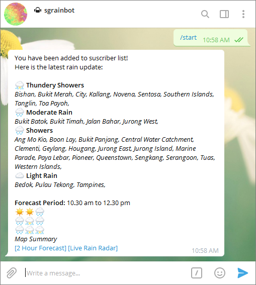

# SG Rain Bot
## Project Summary
In this project, weather data is web-scraped from a government weather website and rain alerts are automatically sent to users through a Telegram bot.

Explore the [webscraping notebook](https://github.com/MichaelOw/SG_Rain_Bot/blob/master/notebooks/web_scraping.ipynb)!

## Run it yourself!

### Step 1: Load Telegram API Token
Create a bot and get the API token: https://core.telegram.org/bots#6-botfather

Open sg_rain_bot.py and edit line below.

    api_token = '' #enter your api token

### Step 2: Run the Python script
    $ python sg_rain_bot.py

### Step 3: Start getting alerts!

